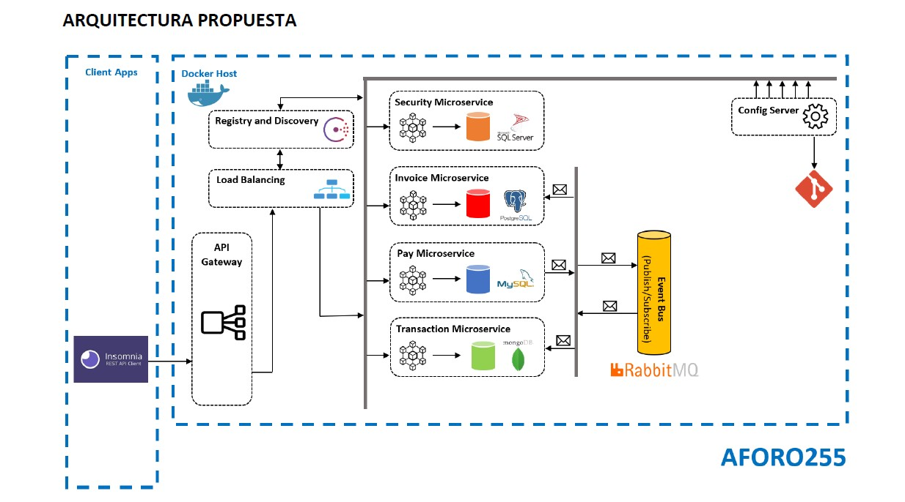

# EXAMEN FINAL
Curso MICROSERVICIOS EN NET CORE: Arquitectura para contenedores - AGO 20

## Proyecto a realizar

    1. Microservicio de Seguridad (Security)
    2. Microservicio de Facturas (Invoice)
    3. Microservicio de Pago (Pay)
    4. Microservicio de Transaccion (Transaction)
    5. Microservicio de Enrutamiento (Gateway)
 
 Fuentes del proyecto en cada una de las carpetas
 
 Scripts de bases de datos:
    Existen varios archivos sql los cuales se alojan dentro de la capeta /Db.
    Los mismos son utilizados durante la ejecucion del docker-compose build.
 
 Componentes creados:
    
    * Docker network: name: aforo255-test
    * Servicio de configuracion centralizada: config-service-test
    * Servicio de colas: bus-service-test
    * Servicio de registro y descubrimiento: consul-service-test
    * Servicio de balanceo: balancer-service-test
    * Microservicio de seguridad dockerizado: app-security
    * Microservicio de invoices dockerizado: app-invoices
    * Microservicio de pagos dockerizado: app-pay
    * Microservicio de transacciones dockerizado: app-transaction
    * Microservicio Gateway: app-gateway
 
 Requisitos:
    - Instalar Docker
    - Ejecutar dentro de cada carpeta de microservicios:
        dotnet publish -c Release --output ./publish
    - Construir los contenedores del proyecto
        docker-compose up -d
